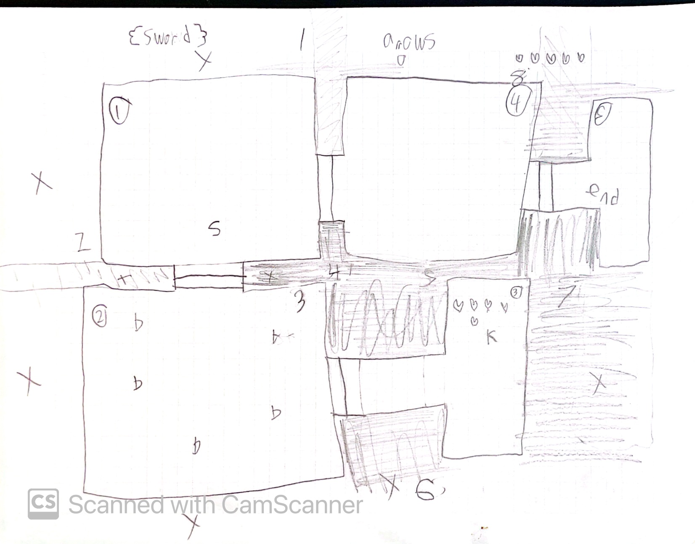
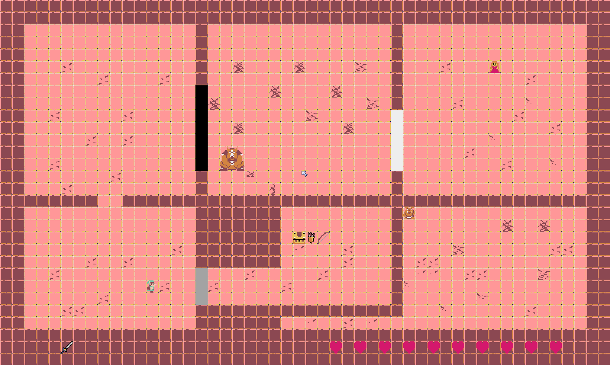
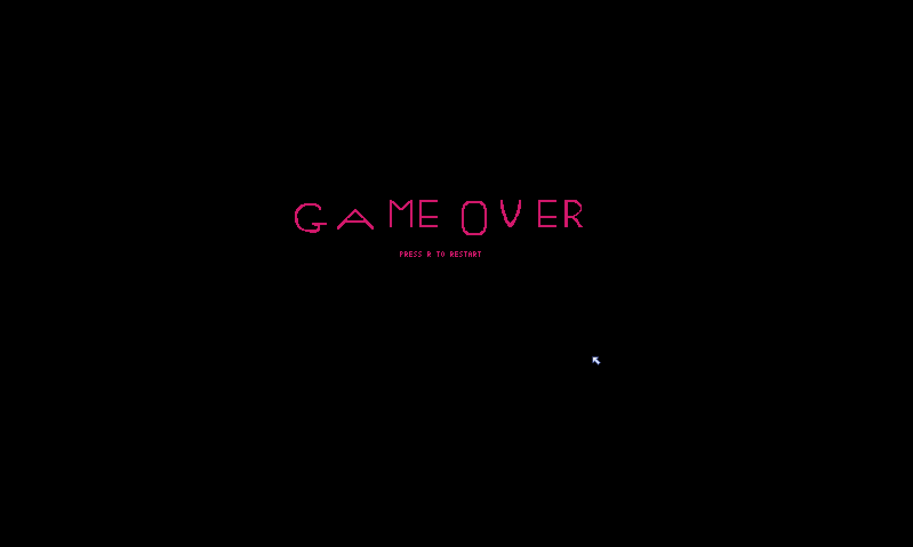
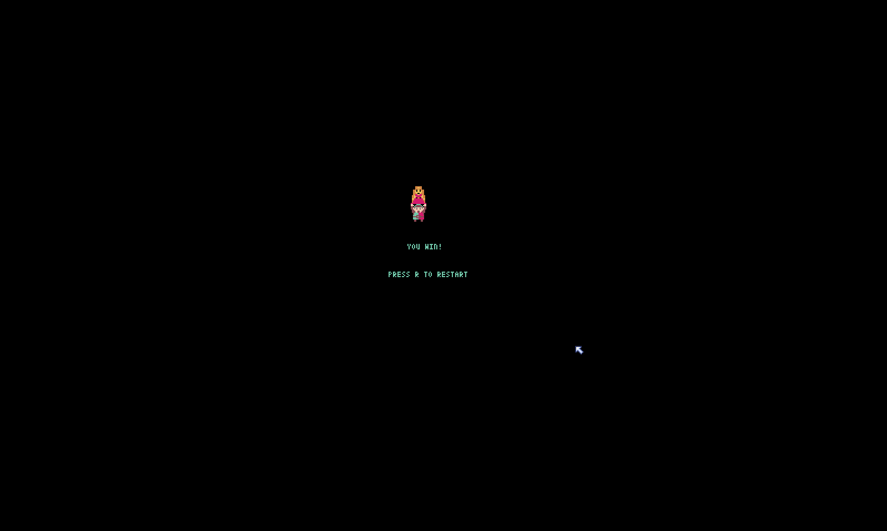
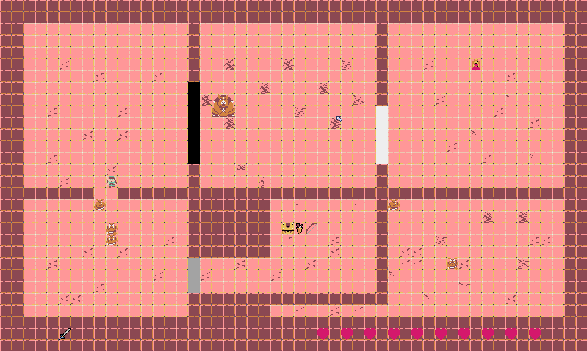
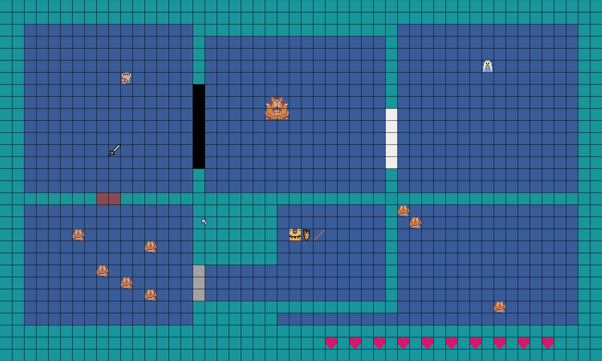
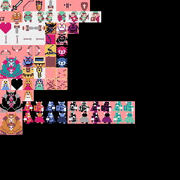
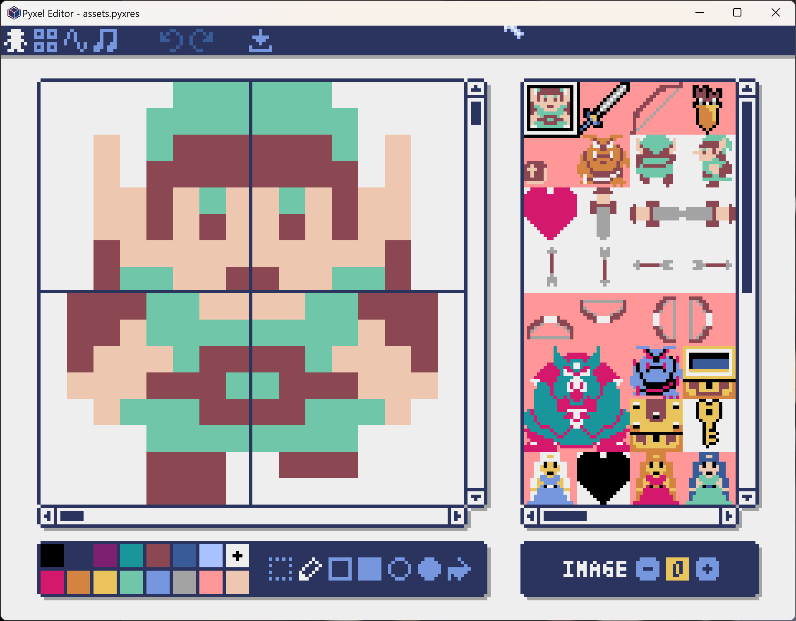
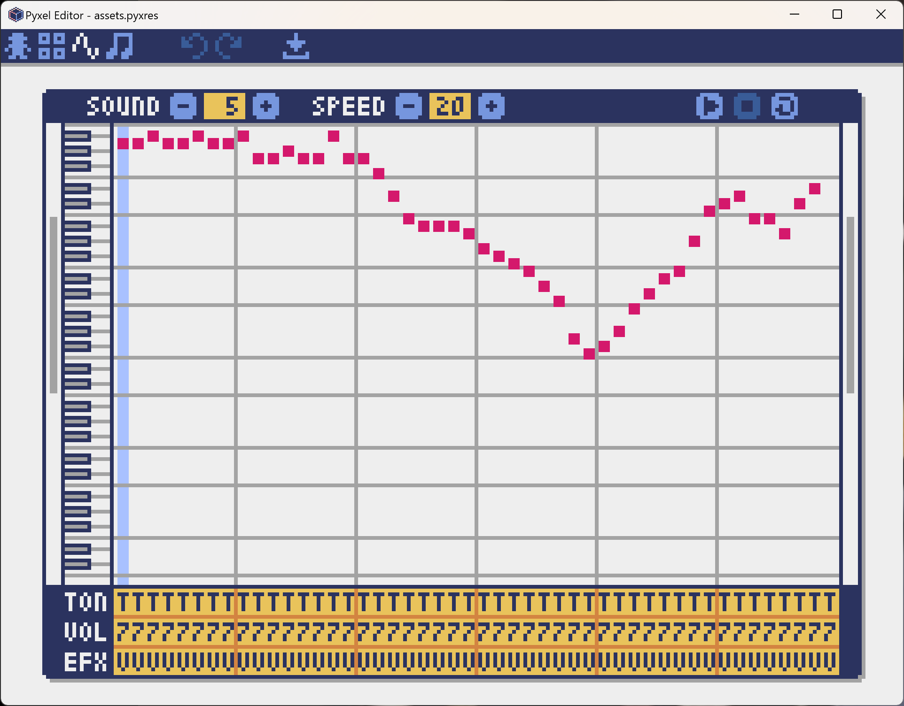

# zelda-lost-levels

Python Zelda game using the Pyxel game engine

# Screenshots








My dad was OCD and made the lines on the grid pixel perfect.





I made all these graphics and music myself in the pyxel editor.

# Instructions

First, install the pyxel game engine:

https://github.com/kitao/pyxel

```
python -m pip install pyxel
```

Then, launch the game:

```
python main.py
```

## Movement

Use the arrow keys to move.

## Weapons

- spacebar for sword
- b key for bow

## Goal

Touch Princess Din to win

# What is this?

This is a 6 room mini zelda dungeon with enemys, doors, and items.

# Who wrote what?

 I wrote 60% and my dad wrote 40% of the code, my dad worked on complecated things like updateArrowPosition and the moblins movement.

# How did you create the graphics and music?

I used the Pyxel editor to create the music, the characters,the items, and the tilemap and used reference to help me.

# Why did you make this game?

I made this game because I love Zelda and this is a great oprotunity to test my coding skills.

# How long did it take you to make this game?

Four months

# What were some challenges or bugs that you overcame?

I took a month trying to make the walls it drove me crazy.

# Name some concepts you learned when making this game?

Basic things like walls, doors, and movement.

# Where can I find the code?

You can find the code at github.com/BenjaminTheCoder/zelda-lost-levels

# Code statistics

- Lines of code: 850
- Number of functions: 12
- Number of dataclasses: 7 
- Number of constants: 7


